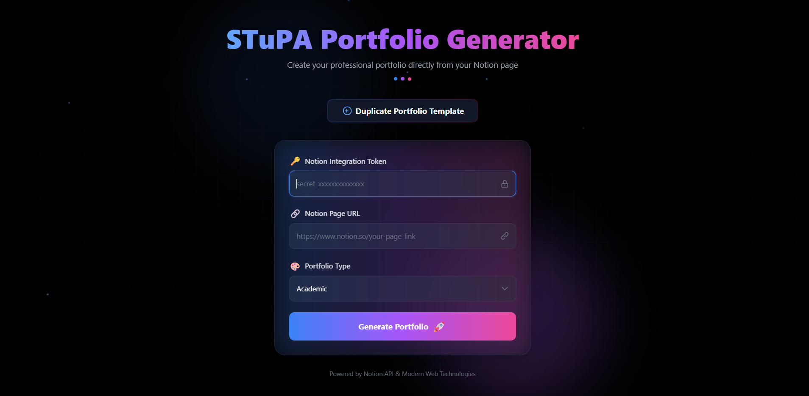
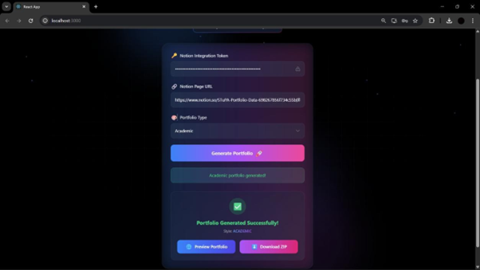
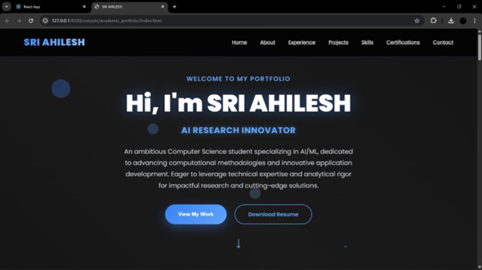
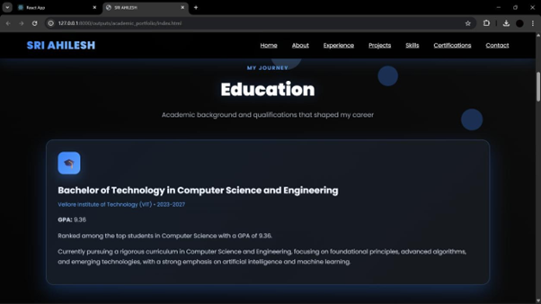

# 🚀 AI-Powered Portfolio Generator

An end-to-end full-stack application that automatically generates professional developer portfolios using AI. This project uses structured data from Notion and transforms it into a polished, ready-to-use portfolio through an intelligent backend pipeline and a clean frontend interface.

---

## 🌐 Live Demo

🚀 Frontend (Live App): https://stupa-portfolio.vercel.app  
⚙️ Backend API: https://stupaportfolio.onrender.com

## 📌 Overview

The AI Portfolio Generator simplifies the process of building a professional portfolio. Instead of manually writing and formatting content, users prepare their data in a structured Notion template, and the system generates a complete portfolio automatically.

This project demonstrates:

* Full-stack development (Frontend + Backend)
* AI/LLM integration
* Notion API integration
* Modular system design
* Real-world deployment architecture

---

## 🧠 Key Features

* ✨ AI-enhanced project descriptions and summaries
* 🧩 Notion-based structured input system
* 🎨 Clean and responsive frontend interface
* ⚡ Fast content generation pipeline
* 🔁 Scalable and reusable backend architecture
* 📄 Ready-to-use portfolio output

---

## 📸 Screenshots

### 🏠 Home Page



### 🔑 Input Section (Notion Token & Page URL)



### 📊 Notion Template (Data Source)


### 📄 Generated Portfolio Output




### 🧾 Data Entry in Notion Tables


---

## 🧭 How to Use

This project follows a **Notion-driven workflow**, where users prepare their data in a predefined template.

👉 **Full step-by-step guide:**
[How to Generate Your Portfolio](./docs/StupaWorking.md)

### Quick Summary

1. Download and duplicate the Notion template
2. Fill in all required details (projects, skills, etc.)
3. Generate a Notion integration token
4. Share your Notion page with the integration
5. Provide:

   * Notion Token
   * Notion Page URL
6. Click **Generate Portfolio**
7. View and download your portfolio

---

## 🏗️ Project Structure

```
StupaPortfolio/
│
├── frontend/        # React-based user interface
├── backend/         # Python backend (AI processing)
├── docs/
│   ├── screenshots/
│   └── StupaWorking.md
├── README.md
└── .gitignore
```

---

## 🛠️ Tech Stack

### Frontend

* React.js
* Vite (or Create React App)
* Tailwind CSS

### Backend

* Python
* FastAPI / Flask
* Notion API
* LLM integration (GPT-based / Gemini)

### Tools

* Git & GitHub
* REST APIs
* JSON-based data flow

---

## ⚙️ Setup Instructions

### 🔹 1. Clone the Repository

```
git clone https://github.com/your-username/StupaPortfolio.git
cd StupaPortfolio
```

---

### 🔹 2. Setup Frontend

```
cd frontend
npm install
npm run dev
```

Frontend runs at:

```
http://localhost:5173   (Vite)
OR
http://localhost:3000   (CRA)
```

---

### 🔹 3. Setup Backend

```
cd backend
python -m venv venv
```

Activate environment:

**Windows:**

```
venv\Scripts\activate
```

**Mac/Linux:**

```
source venv/bin/activate
```

Install dependencies:

```
pip install -r requirements.txt
```

Run server:

```
python main.py
```

OR:

```
uvicorn main:app --reload
```

Backend runs at:

```
http://localhost:8000
```

---

## 🔗 Connecting Frontend & Backend

Create `.env` inside `frontend/`:

```
VITE_API_URL=http://localhost:8000
```

Restart frontend after updating.

---

## 🧠 How It Works (Architecture)

1. **Notion as Data Source**
2. **Backend fetches data via Notion API**
3. **Processing + Structuring layer**
4. **AI enhances content**
5. **Portfolio is generated**
6. **Frontend displays output**

---

## 📦 Important Notes

* `node_modules/` is excluded
* `venv/` is excluded
* `.env` files are not pushed

---

## 🚀 Deployment Guide (Basic)

### Frontend

* Deploy using Vercel or Netlify

### Backend

* Deploy using Render / Railway

### Connect Both

```
VITE_API_URL=https://your-backend-url.com
```

---

## ⚠️ Common Issues

### ❌ Notion data not loading

* Ensure page is shared with integration
* Verify token

### ❌ Frontend not connecting

* Check `.env` API URL

### ❌ Dependencies missing

* Run install commands again

---

## 🌱 Future Improvements

* Authentication system
* Multiple templates
* PDF export
* Custom themes
* Database integration

---

## 👨‍💻 Author

Sri Ahilesh

---

## 📜 License

Open-source for learning and development.

---

## 💡 Final Note

This project separates **content creation (Notion)** from **presentation (Portfolio UI)** — enabling a scalable and AI-driven portfolio generation workflow.

---
